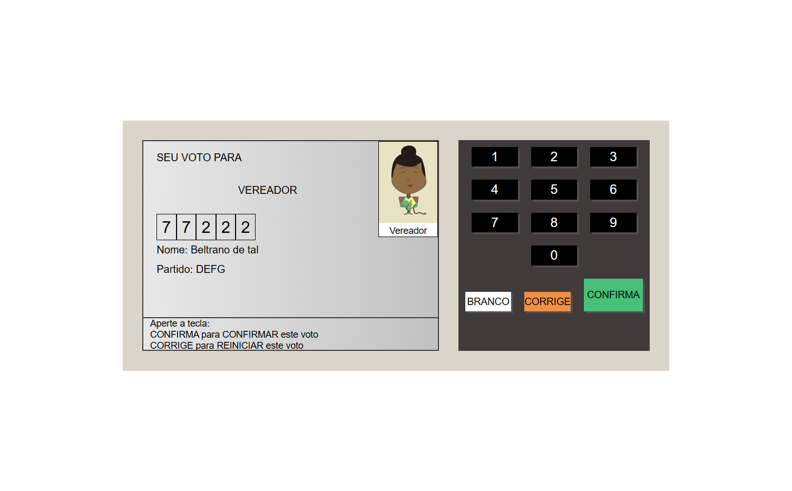

<h1 style="text-align: center;">urna-eletronica</h1>
<p>secret🤫!</p>

## Indice
- [preview](#😁-preview)
- [about](#📃-about)
- [tools](#🔨-tools)
- [how to contribute](#♻️-how-to-contribute)

## 😁 Preview


### [see deploy](https://luan-costa-2l.github.io/urna-eletronica/)
## 📃 About

**urna-eletronica** is one of my first projects.

## 🔨 Tools
- [javascript](https://legacy.reactjs.org/)
- [CSS](https://www.typescriptlang.org/)
- [HTML](https://firebase.google.com/?hl=pt-br) (firestore, fireauth)

## ♻️ How to contribute

```bash
    # Clone the project
    $ git clone https://github.com/Luan-Costa-2l/urna-eletronica
```

```bash
    # Open the directory
    $ cd urna-eletronica
```

```bash
    # OPEN IN YOUR BROWSER
```